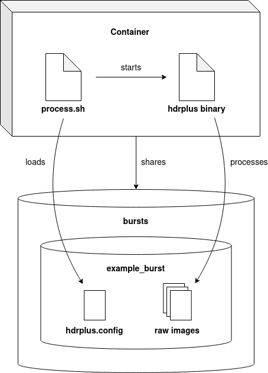

# **Dockerized HDR+ Implementation**

This project provides a Dockefile with instruction to build a container that allows execution of [Timothy Brook's HDR+ implementation](https://github.com/timothybrooks/hdr-plus/}). It allows processing multiple image bursts in parallel.

## How it works



When building the Docker container, the **resources/process.sh** script
is copied into it. It handles starting the HDR+ pipeline for all image
bursts that are stored inside a **bursts** directory. Each pipeline is
execution is started as a background job to enable parallelization.
The amount of background jobs is limited to the amount of CPU threads.

An image burst is identified by an directory containing raw images. Neither name of the raw images and the containing directory, nor the amount of raw images matters for processing. An example directory structure is provided below.

```shell
hdrplus-implementation
├── bursts
│   ├── example_burst
│   │   ├── raw_image1.dng
│   │   ├── raw_image2.dng
│   │   └── raw_image3.dng
│   └── another_example
│       ├── raw_image1.arw
│       ├── raw_image2.arw
│       ├── raw_image3.arw
│       └── raw_image4.arw
├── Dockerfile
├── Makefile
├── README.md
└── resources
    └── process.sh
```

After processing, an output image and a log file are created inside 
each individual burst directory. The output image is named 
**output.png**. As it is unlikely that you want to process every burst
again when running the container, image burst directories containing a
file named **output.png** will be excluded from processing. To
reprocess them, you have to rename or remove the default output image.
An example directory structure after processing is shown below.

```shell
hdrplus-implementation
├── bursts
│   ├── example_burst
│   │   ├── logs
│   │   │   └── 2023-01-01_17:17:17.log
│   │   ├── output.png
│   │   ├── raw_image1.dng
│   │   ├── raw_image2.dng
│   │   └── raw_image3.dng
│   └── another_example
│       ├── logs
│       │   └── 2023-01-01_17:17:20.log
│       ├── output.png
│       ├── raw_image1.arw
│       ├── raw_image2.arw
│       ├── raw_image3.arw
│       └── raw_image4.arw
├── Dockerfile
├── Makefile
├── README.md
└── resources
    └── process.sh
```

You can optionally adjust gain and dynamic range compression used by
the HDR+ pipeline for individual image bursts by setting the
**COMPRESSION** and **GAIN** variables inside a **hdrplus.config** file 
that is stored inside the burst directory. The default values are 1.1 
for **GAIN** and 3.8 for **COMPRESSION**. It is recommended to 
experiment with those values as they affect the quality of the output
image depending on the lighting situation of the image burst. An example
config file is provided below.

```config
GAIN=0.9
COMPRESSION=1.7
```

---

## Setup

The only dependency you need to have installed to be able to run the 
project is Docker. The project was built using version 
**20.10.22, build 3a2c30b** on Ubuntu 20.04.

To build the Docker image you need to run

```shell
docker build -t <imagename> .
```

This can take a while as [Halide](https://github.com/halide/Halide) is
compiled from source during the build process but you only need to build the image once. After building the image has finished, you can process your
image bursts by running

```shell
docker run --rm -v "./bursts":/bursts <imagename>
```

This command will start the container with the local bursts
directory mounted and process all image bursts inside.

For convenience, a Makefile is provided that encapsulated above
commands as make targets. If you use **make**, you can build the
image via `make build` and then run the container via `make run`.
Furthermore you can use `make clean` to remove the **output.png**
and `make clean-logs` to remove all logfiles from each burst directory.

---

